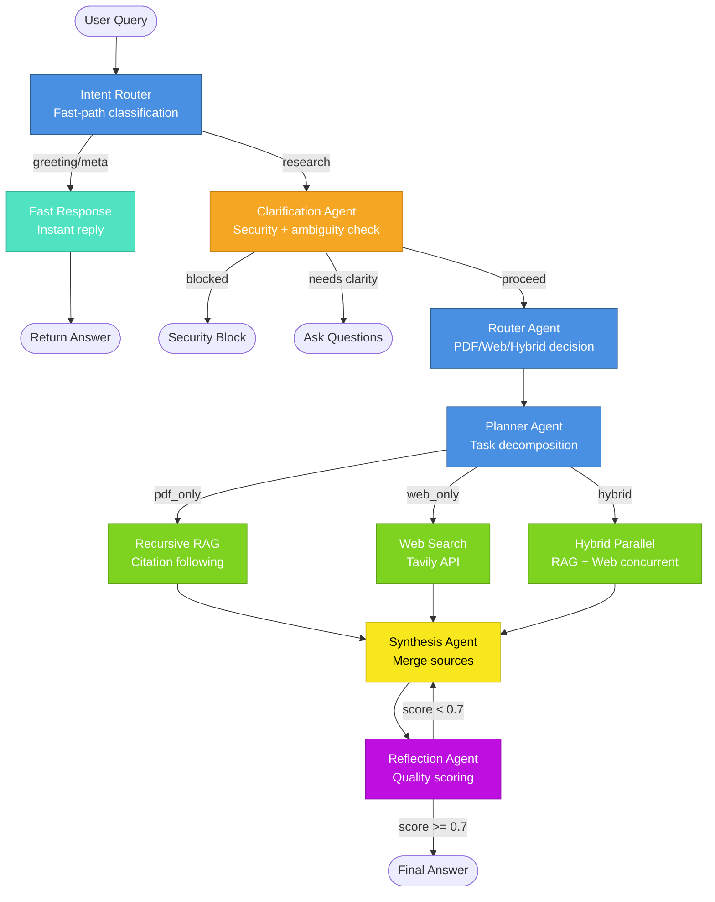

# ArcFusion - Multi-Agent RAG System

**Intelligent Q&A system for academic papers using LangGraph multi-agent architecture**

A production-ready "Chat with PDF" assistant featuring autonomous agents, recursive retrieval, LLM-based security validation, web search integration, and reflection loops for quality control. All agent logic is config-driven with zero hardcoded decision rules.

---

## 🏗️ Architecture

### LangGraph Multi-Agent Flow



---

## 🤖 Agent Descriptions

**All agents use LLM reasoning from `config.ini` prompts - NO hardcoded rules**

| Agent | Purpose | Example Decision |
|-------|---------|------------------|
| **Intent Router** | Fast-path classification for greetings/meta questions → instant response | "Hello" → fast response, "What is attention?" → full pipeline |
| **Clarification** | LLM-based security validation + ambiguity detection | "Tell me more about it" → ask "About what?" |
| **Router** | Semantic routing to PDF/web/hybrid sources using LLM reasoning | "What did OpenAI release?" → web_only |
| **Planner** | Multi-step task decomposition for complex queries | "SOTA approach + author info" → [search PDF, find authors, web search] |
| **Recursive RAG** | Follows citation chains in PDFs with configurable depth | "Zhang et al. results" → retrieves paper + cited works |
| **Web Search** | Tavily API integration with reference tracking | Out-of-scope queries → real-time web results |
| **Synthesis** | Merges PDF + web sources with provenance attribution | Combines RAG + web results with citations |
| **Reflection** | Quality scoring + answer refinement loop | score < 0.7 → revise answer, loop back to synthesis |

---

## 🚀 Quick Start

### Prerequisites
- Docker & Docker Compose
- OpenAI API key
- Pinecone API key
- Tavily API key

### 1. Clone & Configure

```bash
git clone <repository-url>
cd arcfusion-problem

# Create .env file
cp .env.example .env
# Add your API keys:
# OPENAI_API_KEY=sk-...
# PINECONE_API_KEY=pcsk_...
# TAVILY_API_KEY=tvly-...
```

### 2. Run with Docker Compose

```bash
# Start all services
docker compose up -d

# Check logs
docker compose logs -f

# Services will be available at:
# - API: http://localhost:8000
# - Streamlit UI: http://localhost:8501
# - API Docs: http://localhost:8000/docs
```

### 3. Test the API

```bash
# Health check
curl http://localhost:8000/api/v1/health

# Ask a question
curl -X POST http://localhost:8000/api/v1/ask \
  -H "Content-Type: application/json" \
  -d '{
    "query": "What is attention mechanism in transformers?",
    "session_id": "test-session"
  }'

# Clear memory
curl -X POST http://localhost:8000/api/v1/clear_memory \
  -H "Content-Type: application/json" \
  -d '{"session_id": "test-session"}'
```

### 4. Ingest PDFs (if needed)

PDFs are already ingested to Pinecone. To re-ingest:

```bash
docker compose exec api uv run python scripts/ingest_pdfs.py
```

---

## 🛠️ Tech Stack

- **Python 3.11** - Core language
- **LangGraph** - Multi-agent orchestration with StateGraph
- **OpenAI GPT-4o-mini** - LLM for agents + embeddings
- **Pinecone** - Vector database with BGE reranking
- **Tavily** - Web search API
- **FastAPI** - RESTful API server
- **Streamlit** - Optional chat UI
- **Docker** - Containerization with compose
- **uv** - 10x faster Python package manager

---

## 📁 Project Structure

```
arcfusion-problem/
├── src/
│   ├── agents/           # 8 specialized agents
│   │   ├── orchestrator.py      # LangGraph StateGraph
│   │   ├── intent_router.py     # Fast-path classification
│   │   ├── clarification.py     # Security + ambiguity
│   │   ├── router.py            # PDF/web/hybrid routing
│   │   ├── planner.py           # Task decomposition
│   │   ├── recursive_rag.py     # Citation following
│   │   ├── web_search.py        # Tavily integration
│   │   ├── synthesis.py         # Source merging
│   │   └── reflection.py        # Quality control
│   ├── retrieval/        # RAG infrastructure
│   │   ├── vector_store.py      # Pinecone client
│   │   ├── recursive_retriever.py # Multi-hop retrieval
│   │   ├── reranker.py          # BGE reranking
│   │   └── pdf_processor.py     # PDF ingestion
│   ├── memory/           # Conversation state
│   │   ├── session_manager.py   # LangGraph checkpointer
│   │   └── history_manager.py   # Token-based compression
│   ├── core/             # Shared utilities
│   │   ├── llm_client.py        # OpenAI wrapper
│   │   └── embeddings.py        # Embedding client
│   ├── api/              # REST endpoints
│   │   └── routes.py
│   ├── ui/               # Streamlit app
│   │   └── streamlit_app.py
│   └── config.py         # Config loader
├── scripts/
│   ├── ingest_pdfs.py    # PDF → Pinecone script
│   └── simple_test.py    # End-to-end test
├── config.ini            # All prompts + settings (460+ lines)
├── docker-compose.yaml   # Service orchestration
├── Dockerfile            # Container image
└── pyproject.toml        # Python dependencies
```

---

## 📊 API Endpoints

### `POST /api/v1/ask`

Ask a question with session memory.

**Request:**
```json
{
  "query": "What is the state-of-the-art text-to-sql approach?",
  "session_id": "user-123"
}
```

**Response:**
```json
{
  "status": "success",
  "answer": "According to Zhang et al. (2024), SimpleDDL-MD-Chat achieves...",
  "sources": [
    {
      "type": "pdf",
      "source": "zhang_2024.pdf",
      "page": 5,
      "score": 0.92,
      "text_preview": "SimpleDDL-MD-Chat is the top zero-shot template..."
    }
  ],
  "quality_score": 0.85,
  "routing_decision": "pdf_only",
  "iterations": 1
}
```

### `POST /api/v1/clear_memory`

Clear conversation history for a session.

**Request:**
```json
{
  "session_id": "user-123"
}
```

### `GET /api/v1/health`

Health check endpoint.

---

## 🎯 Assignment Requirements Met

### Core Requirements ✅
- [x] **Python + FastAPI** - REST API with async endpoints
- [x] **LangGraph multi-agent** - 8 specialized agents with StateGraph
- [x] **RAG implementation** - Pinecone + recursive retrieval + reranking
- [x] **PDF ingestion script** - `scripts/ingest_pdfs.py` with chunking
- [x] **Session memory** - LangGraph checkpointer + token-based compression
- [x] **RESTful API** - `/ask`, `/clear_memory`, `/health` endpoints
- [x] **Autonomous decision-making** - NO hardcoded logic, all LLM-driven from `config.ini`
- [x] **Docker + docker-compose** - Full containerization with health checks

### Bonus Features ✅
- [x] **Clarification Agent** - Detects ambiguous queries like "Tell me more about it"
- [x] **Evaluation system** - Quality scoring (0-1) + reflection loop
- [x] **Autonomous planning** - Planner agent decomposes complex multi-step queries

### Real-World Scenarios Handled ✅

**1. Ambiguous Questions**
- "Tell me more about it" → Clarification agent asks "About what?"
- "How many examples are enough?" → Detects missing context (dataset, accuracy target)

**2. PDF-Only Queries**
- "Which prompt template gave highest accuracy in Zhang et al.?" → Routes to RAG, retrieves paper
- Recursive retrieval follows citations up to configurable depth

**3. Autonomous Capability**
- "SOTA approach + search web for authors" → Planner breaks into 3 steps:
  1. Search PDFs for SOTA approach
  2. Extract author names
  3. Web search for author info

**4. Out-of-Scope Queries**
- "What did OpenAI release this month?" → Router recognizes out-of-scope → web_only
- NO hardcoded keywords like "current" or "latest" - pure LLM reasoning

---

## ⚙️ Configuration

All agent prompts and settings are in `config.ini` (460+ lines). No logic is hardcoded.

**Key Settings:**
```ini
[rag]
max_recursion_depth = 1       # Citation following depth
top_k = 5                      # Initial retrieval count
rerank_top_k = 3              # After reranking

[agents]
max_iterations = 1            # Reflection loop limit

[memory]
max_history_tokens = 10000    # Trigger compression
keep_recent_tokens = 5000     # Keep in detail
```

**Override with Environment Variables:**
```bash
RAG__MAX_RECURSION_DEPTH=2
AGENTS__MAX_ITERATIONS=3
```

---

## 🔍 How It Works

### 1. Intent Classification (Fast Path)
- Greetings ("Hello") and meta questions → instant response
- Research queries → full pipeline

### 2. Security & Clarity Gate
- LLM validates for security threats (no hardcoded keywords)
- Detects ambiguous queries requiring clarification

### 3. Autonomous Routing
- LLM decides: `pdf_only`, `web_only`, or `hybrid`
- NO hardcoded terms like "current" → pure semantic reasoning

### 4. Planning & Execution
- Complex queries decomposed into steps
- Hybrid mode runs RAG + Web Search in parallel

### 5. Recursive Retrieval
- Follows citation chains in PDFs
- Configurable depth (default: 1 hop)
- BGE reranking for relevance

### 6. Quality Control
- Reflection agent scores answer (0-1)
- If score < 0.7 → revise and loop back to synthesis
- Max iterations configurable (default: 1)

### 7. Memory Management
- Token-based history compression (triggers at 10k tokens)
- LLM summarizes old messages, keeps recent 5k tokens
- Preserves: papers, authors, metrics, user context

---

## 🚀 Future Improvements

### Performance Optimization
- **Target**: <10s per research query (currently ~30-60s)
- **Approaches**:
  - Cache embeddings for frequent queries
  - Parallel execution for hybrid queries (currently sequential)
  - Stream responses token-by-token via SSE
  - Citation-peek: fetch title/abstract before full PDF

### Scalability (Production Deployment)
- **Database**: PostgreSQL for session checkpointer (currently in-memory)
- **Caching**: Redis for LLM responses + embeddings
- **Load Balancing**: Nginx + multiple FastAPI workers
- **Monitoring**: Prometheus metrics + Grafana dashboards
- **Rate Limiting**: Per-user quotas with Redis
- **Async Processing**: Celery for long-running queries

### Advanced Features
- **Multi-document synthesis**: Cross-paper analysis
- **Citation graph visualization**: Interactive knowledge map
- **Custom knowledge base**: Upload your own PDFs
- **Fine-tuning**: Domain-specific embeddings for academic papers
- **Evaluation suite**: Automated testing with golden Q&A pairs

---

## 🧪 Development

### Local Setup (without Docker)

```bash
# Install uv (10x faster than pip)
curl -LsSf https://astral.sh/uv/install.sh | sh

# Install dependencies
uv sync

# Run API
uv run uvicorn src.main:app --reload --port 8000

# Run Streamlit UI
uv run streamlit run src/ui/streamlit_app.py --server.port 8501

# Run tests
uv run python scripts/simple_test.py
```

### Testing Individual Agents

```python
from src.agents.router import router_agent

# Test routing decision
result = await router_agent.route("What did OpenAI release?")
print(result['decision'])  # "web_only"
```

### Debugging

Check `logs/app.log` for colored execution trace:
```
🎯 Node: Intent Router
⚡ Fast path: greeting
🔒 Node: Clarification + Security
✅ Query validated - proceeding
🧭 Node: Router
📍 Routing decision: hybrid (confidence: 0.85)
```

---

## 📝 Code Quality & Production Readiness

- **Separation of Concerns**: Agents, retrieval, memory, API separated
- **No Duplication**: Shared utilities (LLM client, embeddings, config)
- **Logging**: Structured logging with loguru for debugging
- **Error Handling**: Graceful failures with proper HTTP status codes
- **Type Safety**: Type hints throughout codebase
- **Config-Driven**: All prompts externalized to `config.ini`
- **Singleton Pattern**: Shared resources (vector store, LLM client)
- **Async/Await**: Non-blocking I/O for concurrent operations

---

## 📄 License

MIT License

---

## 🤝 Acknowledgments

Built with LangGraph, OpenAI, Pinecone, and Tavily APIs. Assignment for ArcFusion.
